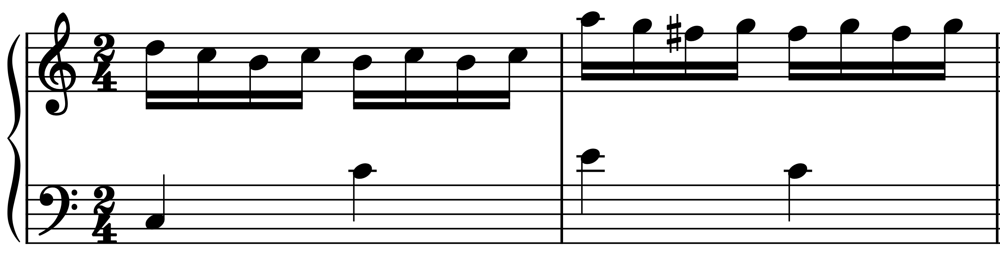

# Matchmaker

Matchmaker is a Python library for real-time music alignment.

Music alignment is a fundamental MIR task, and real-time music alignment is a necessary component of many interactive applications (e.g., automatic accompaniment systems, automatic page turning).

Unlike offline alignment methods, for which state-of-the-art implementations are publicly available, real-time (online) methods have no standard implementation, forcing researchers and developers to build them from scratch for their projects.

We aim to provide efficient reference implementations of score followers for use in real-time applications which can be easily integrated into existing projects.

The full documentation for matchmaker is available online at [readthedocs.org](https://pymatchmaker.readthedocs.io/).

## Setup

**Python version:** 3.10, 3.11, 3.12, 3.13

Choose the installation that fits your use case:

| I want to... | Install |
|---|---|
| Get started quickly — test with recorded audio or MIDI files | `pip install pymatchmaker` |
| Use a locally connected microphone or MIDI keyboard | `pip install pymatchmaker[devices]` |
| Develop or contribute to matchmaker | `pip install -e ".[dev]"` (see below) |

### Option 1: Base install

```bash
pip install pymatchmaker
```

Supports **simulation mode**: run online alignment against recorded audio or MIDI performance files.

> **Note:** Requires [Fluidsynth](https://www.fluidsynth.org/) to be installed on your system:
> ```bash
> conda install -c conda-forge fluidsynth
> ```

### Option 2: Live device support

```bash
pip install pymatchmaker[devices]
```

Adds [PyAudio](https://pypi.org/project/PyAudio/) and [python-rtmidi](https://pypi.org/project/python-rtmidi/) for real-time input from a locally connected microphone or MIDI keyboard.

> **Note:** `pyaudio` requires [PortAudio](http://www.portaudio.com/) to be installed on your system:
> ```bash
> conda install -c conda-forge fluidsynth portaudio
> ```

### Option 3: Development install (from source)

For contributors or anyone who wants to modify the source code. Requires [conda](https://docs.conda.io/projects/conda/en/latest/user-guide/install/index.html).

```bash
# Clone the repository
git clone https://github.com/pymatchmaker/matchmaker.git
cd matchmaker

# Create and activate a conda environment
conda create -n matchmaker python=3.12
conda activate matchmaker

# Install system dependencies
conda install -c conda-forge gcc=12.1.0 glib fluidsynth portaudio

# Install matchmaker in editable mode with all dev dependencies (includes [devices])
pip install -e ".[dev]"
```

> **Note:** `partitura` will download `MuseScore_General.sf3` (a free soundfont) on first use. This may take a moment.

### Known Setup Issues

#### Missing Visual C++ build tools (on Windows)

Download `vs_BuildTools.exe` from <https://visualstudio.microsoft.com/visual-cpp-build-tools/> and run:

```bash
vs_buildtools.exe --norestart --passive --downloadThenInstall --includeRecommended --add Microsoft.VisualStudio.Workload.NativeDesktop --add Microsoft.VisualStudio.Workload.VCTools --add Microsoft.VisualStudio.Workload.MSBuildTools
```

#### Issues with Fluidsynth and pyfluidsynth on Windows

On Windows, pyfluidsynth expects `fluidsynth.exe` to be located in `C:\tools\bin` (some users report `C:\tools\fluidsynth\bin`):

1. Download the ZIP for your Windows version from <https://github.com/FluidSynth/fluidsynth/releases/latest>
2. Extract the contents to `C:\tools` (or wherever pyfluidsynth expects the executable).

#### Using Fluidsynth installed from Homebrew on macOS

We recommend installing Fluidsynth via conda in a dedicated environment. If you use the Homebrew-installed Fluidsynth instead, you may encounter `ImportError("Couldn't find the FluidSynth library.")` with `pyfluidsynth`. See this [Stack Overflow answer](https://stackoverflow.com/a/75339618) for a fix.

## Usage Examples

### Quickstart (simulation mode)

You can test the alignment with a score and a performance file. No extra dependencies needed beyond the base install.

```python
from matchmaker import Matchmaker

mm = Matchmaker(
    score_file=”path/to/score.musicxml”,
    performance_file=”path/to/performance.wav”,
    input_type=”audio”,
)
for current_position in mm.run():
    print(current_position)  # beat position in the score
```

The returned value is the current position in the score, represented in beats defined by `partitura` library's note array system.
Specifically, each position is calculated for every frame input and interpolated within the score's `onset_beat` array.
Please refer to [here](https://partitura.readthedocs.io/en/latest/Tutorial/notebook.html) for more information about the `onset_beat` concept.

### Live streaming (requires `[devices]`)

To run with a live audio or MIDI input, install with `pip install pymatchmaker[devices]`.

```python
mm = Matchmaker(
    score_file=”path/to/score.musicxml”,
    input_type=”audio”,
    device_name_or_index=”MacBookPro Microphone”,
)
for current_position in mm.run():
    print(current_position)
```

If no device is specified, the system default is used.

```python
from matchmaker import Matchmaker

# Audio input
mm = Matchmaker(
    score_file=”path/to/score.musicxml”,
    input_type=”audio”,
)

# MIDI input
mm = Matchmaker(
    score_file=”path/to/score.musicxml”,
    input_type=”midi”,
)
```


### Streaming from a non-device source (`BytesAudioStream` / `BytesMidiStream`)

For input that does not come from a local audio / MIDI device (a WebSocket
handler forwarding browser data, a subprocess, an IPC pipe, etc.), use the
built-in `BytesAudioStream` and `BytesMidiStream` classes. Both pull raw
`bytes` chunks from a `queue.Queue` you control and feed them through the
same processor pipeline as the device-backed streams. No `pyaudio` or
`python-rtmidi` install is required.

**Audio.** The producer pushes raw `float32` PCM bytes (one `hop_length`
chunk per item), followed by `None` to end the stream:

```python
import queue
from matchmaker import Matchmaker
from matchmaker.io.audio import BytesAudioStream
from matchmaker.features.audio import ChromagramProcessor

data_queue = queue.Queue()

# In a producer thread (e.g. WebSocket handler):
#     data_queue.put(pcm_chunk_bytes)   # float32 PCM, hop_length samples
#     ...
#     data_queue.put(None)              # end of stream

stream = BytesAudioStream(
    processor=ChromagramProcessor(sample_rate=22050, hop_length=441),
    sample_rate=22050,
    hop_length=441,
    data_queue=data_queue,
)
mm = Matchmaker(
    score_file="path/to/score.musicxml",
    input_type="audio",
    stream=stream,
)
for current_position in mm.run():
    print(current_position)
```

**MIDI.** The producer pushes raw MIDI bytes (e.g. 3 bytes per `note_on` /
`note_off`, exactly what the Web MIDI API gives you):

```python
import queue
from matchmaker import Matchmaker
from matchmaker.io.midi import BytesMidiStream
from matchmaker.features.midi import PitchProcessor

data_queue = queue.Queue()

# In a producer thread:
#     data_queue.put(midi_bytes)   # e.g. bytes([0x90, 60, 100])
#     ...
#     data_queue.put(None)

stream = BytesMidiStream(processor=PitchProcessor(), data_queue=data_queue)
mm = Matchmaker(
    score_file="path/to/score.musicxml",
    input_type="midi",
    stream=stream,
)
for current_position in mm.run():
    print(current_position)
```

The browser side just forwards what Web MIDI API hands it:

```javascript
const midiAccess = await navigator.requestMIDIAccess();
midiAccess.inputs.forEach((input) => {
  input.onmidimessage = (event) => {
    // event.data is a Uint8Array (typically 3 bytes for note_on / note_off)
    ws.send(event.data);   // forward as a binary WebSocket frame
  };
});
```

The Python WebSocket handler reads the binary frame and calls
`data_queue.put(message_bytes)`. No JSON / dict / base64 conversion is
needed at any layer.


### Running Examples

The repository includes a ready-to-use example script that demonstrates the complete workflow:

```bash
# Run with input type (uses default method by each input)
python run_examples.py --audio

# Run with specific method
python run_examples.py --midi --method hmm
```

This script runs a complete example with score following and evaluation, saving results to the `results/` directory.

### Testing with Different Methods or Features

You can specify the alignment method and feature processor as follows:

```python
from matchmaker import Matchmaker

mm = Matchmaker(
    score_file="path/to/score",
    input_type="audio",
    method="arzt",       # see Alignment Methods section
    processor="chroma",  # see Features section
)
for current_position in mm.run():
    print(current_position)
```

For options regarding the `method`, please refer to the [Alignment Methods](#alignment-methods) section.
For options regarding the `processor`, please refer to the [Features](#features) section.


## Package Overview

Matchmaker has the following pipeline:

```
   input source              Stream              Processor              OnlineAlignment
   (audio/MIDI                                   (chroma,               (e.g.,
    file or live)      ─►   AudioStream    ─►    pitch_chord,    ─►    PitchHMM,        ─►   alignment_path
                            MidiStream           ...)                   OLTWArzt, ...)        (2, T) array
```

### Component signatures

- **`Stream`** (`AudioStream`, `MidiStream`) reads from a file or live
  device, hands each frame to its Processor, and pushes the result to a
  `RECVQueue`, followed by a `STREAM_END` sentinel when the source is
  exhausted.

- **`Processor`** (e.g., `ChromagramProcessor`, `PitchChordProcessor`) takes
  a `(data, frame_time)` tuple and returns either a `(features, perf_time)`
  tuple or `None` while buffering. `data` is `np.ndarray` for audio or
  `List[(mido.Message, m_time)]` for MIDI; `perf_time` is the timestamp the
  feature corresponds to (most processors pass `frame_time` through;
  chord-buffering MIDI processors emit the chord onset).

- **`OnlineAlignment`** (the score follower base class; e.g.,
  `OnlineTimeWarpingArzt`, `PitchIOIHMM`) consumes `(features, perf_time)`
  observations from the queue (or directly via `__call__`), updates its
  score position per step, and yields the current beat. On stream end it
  returns the final `alignment_path` — a `(2, T)` `np.ndarray` of
  `(score_beat, perf_time)` pairs.

`STREAM_END` is a module-level sentinel (not a tuple); `OnlineAlignment.run()`
checks for it and exits the read loop.

### Score representation

The example score `matchmaker/assets/simple_mozart_k265_var1.musicxml` is
used in tests and the contribution guide. The first two measures:

<p align="center">
  
</p>

Beat positions follow the `onset_beat` field of partitura's `note_array()`,
whose unit is the score's denominator (the quarter note for this 2/4 piece).
Notes start at beats `0.00, 0.25, 0.50, 0.75, 1.00, ...`.

```python
import numpy as np
import partitura as pt

score = pt.load_score("matchmaker/assets/simple_mozart_k265_var1.musicxml")
note_array = score[0].note_array()
score_positions = np.unique(note_array["onset_beat"])
# array([0.  , 0.25, 0.5 , 0.75, 1.  , ..., 13.25, 13.5 ])  shape (54,)
```

If a score follower reaches the third unique onset:
```python
follower.current_index    # 2
follower.current_position # 0.5  (= score_positions[2])
```

## Alignment Methods

### Audio (`input_type="audio"`)

Default method: `"arzt"`

| Method | Description |
|---|---|
| `"arzt"` | On-line time warping adapted from Brazier and Widmer (2020) |
| `"dixon"` | On-line time warping by Dixon (2005) |
| `"outerhmm"` | Outer-product HMM score follower by Nakamura (2014) |
| `"skf"` | Switching Kalman Filter with hidden tempo by Jiang and Raphael (2020) |

### MIDI (`input_type="midi"`)

Default method: `"pthmm"`

| Method | Description |
|---|---|
| `"arzt"` | On-line time warping adapted from Brazier and Widmer (2020) |
| `"dixon"` | On-line time warping by Dixon (2005) |
| `"outerhmm"` | Outer-product HMM score follower by Nakamura (2014) |
| `"hmm"` | HMM score follower by Cancino-Chacón et al. (2023) |
| `"pthmm"` | Pitch-based HMM score follower |

## Features

### Audio (`input_type="audio"`)

Default processor: `"chroma"`

| Processor | Description |
|---|---|
| `"chroma"` | Chroma features |
| `"mfcc"` | Mel-frequency cepstral coefficients |
| `"cqt"` | Constant-Q transform |
| `"mel"` | Mel-spectrogram |
| `"lse"` | Log-spectral energy features used in Dixon (2005) |
| `"cqt_spectral_flux"` | CQT-based spectral flux used in Nakamura (2014) |
| `"raw_spectrum"` | Raw power spectrum used in Jiang and Raphael (2020) |

### MIDI (`input_type="midi"`)

Default processor: `"pitch_chord"`

| Processor | Description |
|---|---|
| `"pitch_chord"` | Pitch features grouped per chord onset |
| `"pitch"` | Pitch features per note (no chord grouping) |
| `"pianoroll"` | Piano-roll features |
| `"pitchclass"` | Pitch class features |

## Configurations

Initialization parameters for the `Matchmaker` class:

| Parameter | Type | Default | Description |
|---|---|---|---|
| `score_file` | str | | Path to the score file (`.musicxml`, `.mid`, etc.) |
| `performance_file` | str or None | `None` | Path to a recorded performance file for simulation mode. If `None`, live device input is used. |
| `input_type` | str | `"audio"` | Input modality. Options: `"audio"`, `"midi"`. |
| `method` | str or None | `None` | Alignment method. Defaults to `"arzt"` for audio, `"pthmm"` for MIDI. See [Alignment Methods](#alignment-methods). |
| `processor` | str or None | `None` | Feature processor. Defaults to `"chroma"` for audio, `"pitch_chord"` for MIDI. See [Features](#features). |
| `kwargs` | dict or None | `None` | Method-specific parameters (e.g., `window_size`, `sample_rate`, `frame_rate`). If `None`, built-in defaults for the chosen method are used. |
| `stream` | Stream or None | `None` | Custom `Stream` instance for external input sources (e.g., WebSocket). If `None`, the stream is built automatically from `input_type`. |
| `device_name_or_index` | str or int or None | `None` | Audio/MIDI device name or index for live input. Requires `pymatchmaker[devices]`. |
| `tempo` | float or None | `None` | Initial tempo in BPM for score rendering. If `None`, inferred from the score. |
| `wait` | bool | `False` | If `True`, block until the score follower finishes before returning from `run()`. |
| `unfold_score` | bool | `True` | If `True`, unfold repeat signs in the score before alignment. |

## Contributing

If you want to add a new score follower, please refer to [HOW_TO_CONTRIBUTE.md](HOW_TO_CONTRIBUTE.md)
for the `OnlineAlignment` interface, boilerplate, and audio/MIDI tips.
The same guide is also available in the [online docs](https://pymatchmaker.readthedocs.io/en/latest/contribute.html).

## Citing Matchmaker

If you find Matchmaker useful, we would appreciate if you could cite us!

```bibtex
@inproceedings{park_matchmaker_2025,
	title = {Matchmaker: {An} {Open}-{Source} {Library} for {Real}-{Time} {Piano} {Score} {Following} and {Systematic} {Evaluation}},
	booktitle = {Proceedings of the 26th {International} {Society} for {Music} {Information} {Retrieval} {Conference} ({ISMIR} 2025)},
	author = {Park, Jiyun and Cancino-Chacón, Carlos and Chiruthapudi, Suhit and Nam, Juhan},
    address = {Daejeon, South Korea}
	year = {2025}
}
```

```bibtex
@inproceedings{matchmaker_lbd,
  title={{Matchmaker: A Python library for Real-time Music Alignment}},
  author={Park, Jiyun and Cancino-Chac\'{o}n, Carlos and Kwon, Taegyun and Nam, Juhan},
  booktitle={{Proceedings of the Late Breaking/Demo Session at the 25th International Society for Music Information Retrieval Conference}},
  address={San Francisco, USA.},
  year={2024}
}
```


## Acknowledgments

This work has been supported by the Austrian Science Fund (FWF), grant agreement PAT 8820923 ("*Rach3: A Computational Approach to Study Piano Rehearsals*"). Additionally, this work was supported by the National Research Foundation of Korea (NRF) grant funded by the Korea government (MSIT) (No. NRF-2023R1A2C3007605).

## License

This project is licensed under the Apache License 2.0 - see the [LICENSE](LICENSE) file for details.
